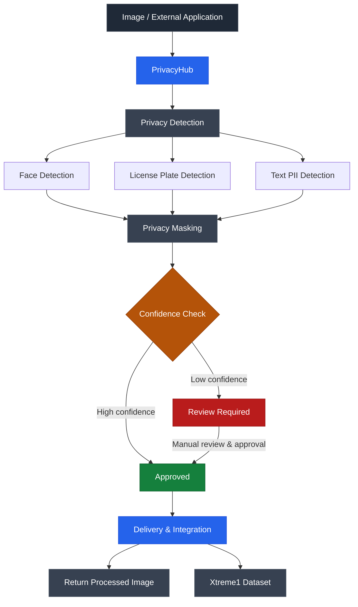
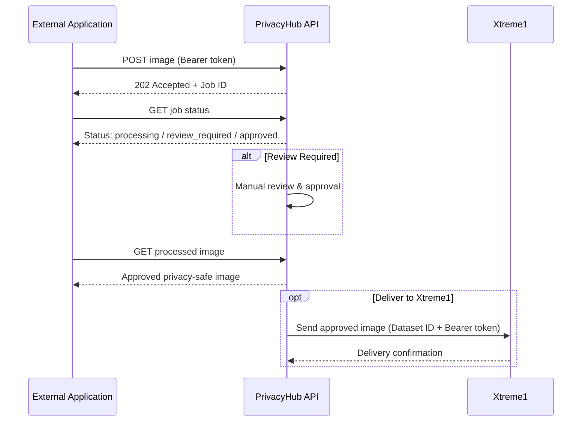

# Privacy-Preserving Annotation System

A privacy-preserving AI platform that detects and anonymizes sensitive information in images before they are used for annotation.

The system automatically detects **faces, license plates, and text-based PII** — including names, phone numbers, email addresses, and ID numbers — and masks that information before an image is sent downstream for annotation. This reduces the exposure of sensitive data throughout the annotation pipeline.

For cases where automatic detection needs verification, the platform supports **human-in-the-loop review**: images flagged as **Review Required** can be manually checked and approved before delivery.

---

## Table of Contents

- [How It Works](#how-it-works)
- [Main Features](#main-features)
- [Technologies](#technologies)
- [Project Structure](#project-structure)
- [Run with Docker](#run-with-docker)
- [Local Development](#local-development)
- [Running PrivacyHub](#running-privacyhub)
- [API Workflow](#api-workflow)
- [Xtreme1 Delivery](#xtreme1-delivery)

---

## How It Works



PrivacyHub provides a **web interface built with FastAPI** and a **REST API** for external applications.

External applications authenticate with a **Bearer token**, submit images for processing, receive a job ID, poll job status, and retrieve the processed image once it's ready. The API also handles **token management, usage tracking, rate limiting, and job tracking**.

Once an image is approved as privacy-safe, it can be delivered directly to **Xtreme1** using a dataset ID and Bearer token.

---

## Main Features

| Category | Capabilities |
|---|---|
| **Detection** | Face detection, license plate detection, OCR-based text detection, PII detection (names, emails, phone numbers, IDs) |
| **Processing** | Confidence-based routing, automatic masking, human review for uncertain detections |
| **API** | FastAPI REST API, Bearer-token authentication, token generation/expiry/revocation, usage tracking, rate limiting, asynchronous job tracking |
| **Delivery** | Return processed image directly, or deliver to Xtreme1 |
| **Interface** | Web-based PrivacyHub dashboard |

---

## Technologies

- **Language:** Python
- **Web Framework:** FastAPI
- **Computer Vision:** OpenCV, YOLO, PaddleOCR
- **ML/DL:** PyTorch, Hugging Face Transformers, ONNX Runtime
- **Database:** SQLite
- **Frontend:** HTML, CSS, JavaScript
- **Integration:** Xtreme1
- **Deployment:** Docker

---

## Project Structure

```text
privacy-preserving-annotation/
│
├── data/                  # Data and project resources
├── evaluation/            # Evaluation scripts and metrics
├── modules/               # Core processing modules
├── privacy_engine/        # Detection and masking logic
├── privacy_module/        # Privacy-related utilities
├── privacyhub_web/        # FastAPI web application
├── scripts/               # Helper / utility scripts
│
├── .dockerignore          # Docker build exclusions
├── .gitignore             # Git exclusions
├── Dockerfile             # Docker image configuration
├── docker-compose.yml     # Docker Compose configuration
├── requirements.txt       # Core dependencies
└── requirements-full.txt  # Full dependency set
```

---

## Run with Docker

The easiest way to run PrivacyHub is using the pre-built Docker image available on Docker Hub.

### Requirements

- Docker Desktop installed and running

### 1. Pull the Docker Image

```bash
docker pull rachit1104/privacy-preserving-annotation:latest
```

### 2. Start PrivacyHub

```bash
docker run -d --name privacy-app -p 8501:8501 -e WEB_HOST=0.0.0.0 -e WEB_PORT=8501 -e OPEN_BROWSER=0 rachit1104/privacy-preserving-annotation:latest
```

### 3. Check if the Container is Running

```bash
docker ps
```

You should see `privacy-app` running with port `8501` mapped.

### 4. Open PrivacyHub

Open in your browser:

```text
http://localhost:8501
```

### Check All Containers

To see both running and stopped containers:

```bash
docker ps -a
```

### View Application Logs

To view the PrivacyHub logs:

```bash
docker logs privacy-app
```

To continuously watch the logs:

```bash
docker logs -f privacy-app
```

Press `Ctrl + C` to stop watching the logs.

### Stop the Application

```bash
docker stop privacy-app
```

### Start it Again

```bash
docker start privacy-app
```

### Remove the Container

```bash
docker rm -f privacy-app
```

> If the container is removed, run the `docker run` command again to create a new one.

---

## Local Development

For development without Docker, clone the repository and install the dependencies locally.

### 1. Clone the Repository

```bash
git clone https://github.com/snehaja05d/privacy-preserving-annotation.git
cd privacy-preserving-annotation
```

### 2. Create a Virtual Environment

```bash
python -m venv .venv
```

### 3. Activate the Environment

**Windows (PowerShell):**

```powershell
.\.venv\Scripts\Activate.ps1
```

**macOS / Linux:**

```bash
source .venv/bin/activate
```

### 4. Install Dependencies

```bash
pip install -r requirements.txt
```

For the complete dependency set:

```bash
pip install -r requirements-full.txt
```

---

## Running PrivacyHub

Start the web application locally:

```powershell
.\.venv\Scripts\python.exe .\privacyhub_web\run_web.py
```

Once the server starts, open:

```text
http://127.0.0.1:8501
```

Interactive FastAPI documentation (Swagger UI) is available at:

```text
http://127.0.0.1:8501/docs
```

---

## API Workflow

External applications communicate with PrivacyHub through the REST API using the following flow:



> **Note:** All API requests require a valid PrivacyHub Bearer token.

---

## Xtreme1 Delivery

Approved, privacy-safe images can be delivered directly to an **Xtreme1 dataset** through the Delivery & Integrations section.

**Required:**

- Xtreme1 Dataset ID
- Xtreme1 Bearer Token
- An approved privacy-safe image

Only the protected (masked) image is ever sent to the annotation environment — raw or unmasked images are never transmitted downstream.
