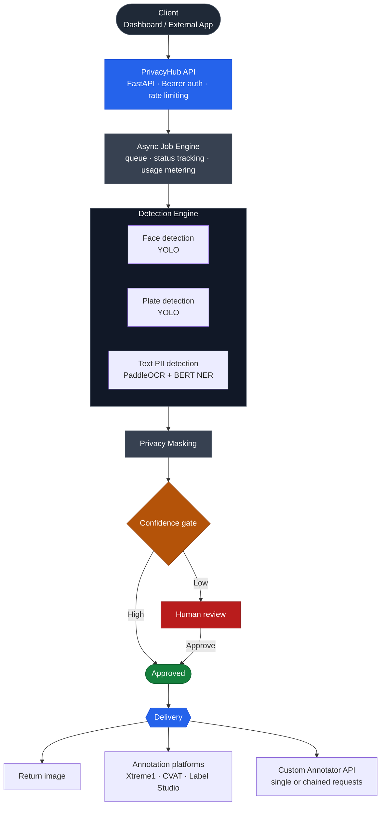
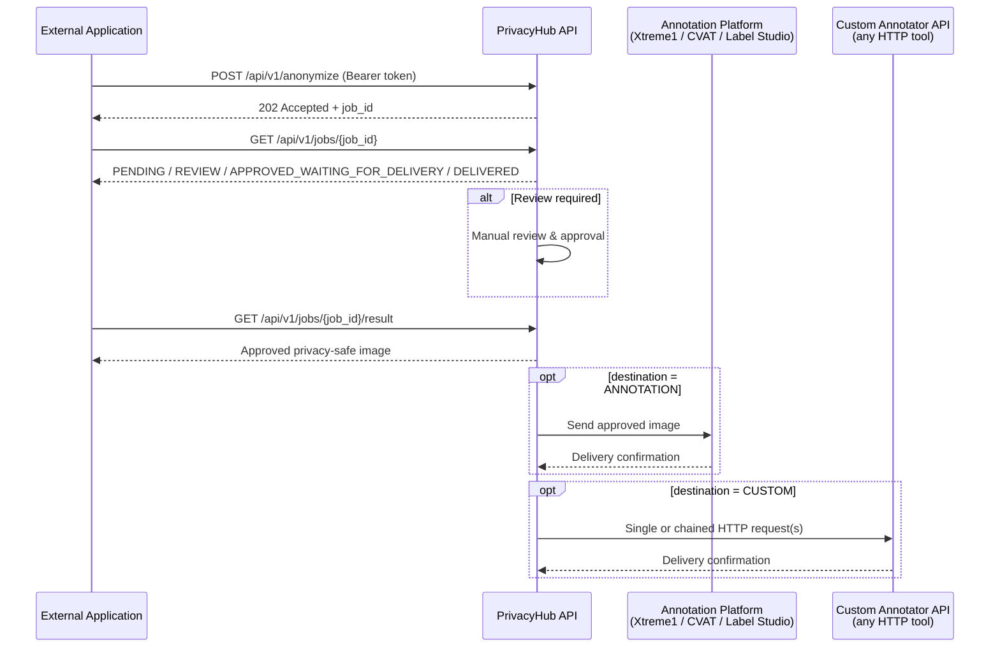

# Privacy-Preserving Annotation System


Detect and anonymize sensitive information in images **before** they reach human annotators. Faces, license plates, and text-based PII (names, phone numbers, emails, IDs) are found and masked automatically; uncertain cases go through human review; approved images are delivered straight into your annotation tool.

---

## Table of Contents

- [Overview](#overview)
- [Features](#features)
- [Architecture](#architecture)
- [Delivery Options](#delivery-options)
- [Quick Start (Docker)](#quick-start-docker)
- [Local Development](#local-development)
- [Configuration](#configuration)
- [API Reference](#api-reference)
- [Annotation Platform Delivery](#annotation-platform-delivery)
- [Custom Annotator API](#custom-annotator-api)
- [Evaluation](#evaluation)
- [Performance Tips](#performance-tips)
- [Project Structure](#project-structure)
- [Screenshots](#screenshots)
- [Contributing](#contributing)

---

## Overview

Annotation pipelines routinely expose raw, sensitive imagery to labeling teams and third-party platforms. PrivacyHub sits in front of the annotation step: every image is scanned for privacy-sensitive content, masked, and only then released downstream. Nothing unmasked ever leaves the system.

**What it detects**

| Category | Method |
|---|---|
| Faces | YOLO-based detection |
| License plates | YOLO-based detection |
| Text PII (names, emails, phones, IDs) | PaddleOCR + BERT NER |

**How it decides** — each detection carries a confidence score. High-confidence results are masked and approved automatically; low-confidence results are routed to **human-in-the-loop review**, where a reviewer approves or rejects before anything is delivered.

---

## Features

- **Automatic PII detection & masking** — faces, plates, and text PII masked in one pass
- **Confidence-based routing** — auto-approve when confident, human review when not
- **Three delivery paths** — return the image, push to a built-in annotation platform, or integrate any tool via the Custom Annotator API
- **Chained request flows** — multi-step upload workflows (presigned URLs, task creation) with response capture and variable substitution
- **REST API for external apps** — Bearer-token auth, async jobs, usage tracking, rate limiting
- **Web dashboard** — upload, monitor, review, and deliver from the browser

---

## Architecture


```mermaid
flowchart TB
    Client(["Client<br/>Dashboard / External App"]) --> API["PrivacyHub API<br/>FastAPI · Bearer auth · rate limiting"]
    API --> Jobs["Async Job Engine<br/>queue · status tracking · usage metering"]
    Jobs --> Engine
    subgraph Engine["Detection Engine"]
        direction LR
        Face["Face detection<br/>YOLO"]
        Plate["Plate detection<br/>YOLO"]
        Text["Text PII detection<br/>PaddleOCR + BERT NER"]
    end
    Engine --> Mask["Privacy Masking"]
    Mask --> Gate{"Confidence gate"}
    Gate -->|"High"| Approved(["Approved"])
    Gate -->|"Low"| Review["Human review"]
    Review -->|"Approve"| Approved
    Approved --> Delivery{{"Delivery"}}
    Delivery --> D1["Return image"]
    Delivery --> D2["Annotation platforms<br/>Xtreme1 · CVAT · Label Studio"]
    Delivery --> D3["Custom Annotator API<br/>single or chained requests"]

    style Client fill:#1f2937,stroke:#4b5563,color:#fff
    style API fill:#2563eb,stroke:#1d4ed8,color:#fff
    style Jobs fill:#374151,stroke:#4b5563,color:#fff
    style Engine fill:#111827,stroke:#4b5563,color:#fff
    style Mask fill:#374151,stroke:#4b5563,color:#fff
    style Gate fill:#b45309,stroke:#92400e,color:#fff
    style Approved fill:#15803d,stroke:#166534,color:#fff
    style Review fill:#b91c1c,stroke:#991b1b,color:#fff
    style Delivery fill:#2563eb,stroke:#1d4ed8,color:#fff
```

---

## Delivery Options

| # | Option | Use when |
|---|---|---|
| 1 | **Return Image** | You just want the masked image back (API or download) |
| 2 | **Annotation Platform** | One-click delivery to **Xtreme1**, **CVAT**, or **Label Studio** via built-in integrations |
| 3 | **Custom Annotator API** | Your tool isn't built in — configure any HTTP upload, from a single request to an 8-step chained flow |

---

## Quick Start (Docker)

**Requirements:** Docker Desktop installed and running.

```bash
# 1. Pull the image
docker pull rachit1104/privacy-preserving-annotation:latest

# 2. Run it
docker run -d --name privacy-app -p 8501:8501 \
  -e WEB_HOST=0.0.0.0 -e WEB_PORT=8501 -e OPEN_BROWSER=0 \
  rachit1104/privacy-preserving-annotation:latest

# 3. Open http://localhost:8501
```

Useful commands:

```bash
docker ps            # check it's running
docker logs -f privacy-app   # watch logs (Ctrl+C to stop)
docker stop privacy-app      # stop
docker start privacy-app     # start again
docker rm -f privacy-app     # remove
```

---

## Local Development

```bash
# 1. Clone
git clone https://github.com/snehaja05d/privacy-preserving-annotation.git
cd privacy-preserving-annotation

# 2. Virtual environment
python -m venv .venv

# Windows (PowerShell)
.\.venv\Scripts\Activate.ps1
# macOS / Linux
source .venv/bin/activate

# 3. Install dependencies
pip install -r requirements.txt        # core
pip install -r requirements-full.txt  # complete set

# 4. Run
.\.venv\Scripts\python.exe .\privacyhub_web\run_web.py   # Windows
# python privacyhub_web/run_web.py                        # macOS / Linux
```

Open `http://127.0.0.1:8501` — Swagger UI lives at `http://127.0.0.1:8501/docs`.

> The ML models (YOLO, PaddleOCR, BERT NER) load in the background at startup (~20–30 s). The first protection run also warms up OCR inference, so it's slower than subsequent runs.

---

## Configuration

| Variable | Default | Description |
|---|---|---|
| `WEB_HOST` | `127.0.0.1` | Host the server binds to (`0.0.0.0` in Docker) |
| `WEB_PORT` | `8501` | Port the server listens on |
| `OPEN_BROWSER` | `1` | `1` opens the dashboard in a browser on start, `0` disables it |

---

## API Reference

External applications authenticate with a **Bearer token**, submit images, poll job status, and fetch results:


```mermaid
sequenceDiagram
    participant App as External Application
    participant API as PrivacyHub API
    participant AP as Annotation Platform<br/>(Xtreme1 / CVAT / Label Studio)
    participant CA as Custom Annotator API<br/>(any HTTP tool)

    App->>API: POST /api/v1/anonymize (Bearer token)
    API-->>App: 202 Accepted + job_id
    App->>API: GET /api/v1/jobs/{job_id}
    API-->>App: PENDING / REVIEW / APPROVED_WAITING_FOR_DELIVERY / DELIVERED

    alt Review required
        API->>API: Manual review & approval
    end

    App->>API: GET /api/v1/jobs/{job_id}/result
    API-->>App: Approved privacy-safe image

    opt destination = ANNOTATION
        API->>AP: Send approved image
        AP-->>API: Delivery confirmation
    end

    opt destination = CUSTOM
        API->>CA: Single or chained HTTP request(s)
        CA-->>API: Delivery confirmation
    end
```

### Endpoints

| Method | Endpoint | Purpose |
|---|---|---|
| `POST` | `/api/v1/anonymize` | Submit an image for anonymization |
| `GET` | `/api/v1/jobs/{job_id}` | Check job status |
| `GET` | `/api/v1/jobs/{job_id}/result` | Download the protected image (`destination=RETURN`) |

### `POST /api/v1/anonymize` parameters (multipart/form-data)

| Field | Description |
|---|---|
| `file` | Image to process (required) |
| `selected_types` | Comma-separated detection types. Default: `FACE,PLATE,EMAIL,PHONE,NAME,ID` |
| `destination` | `RETURN` (default), `ANNOTATION`, or `CUSTOM`. `XTREME1` accepted for backward compatibility |
| `annotation_platform` | `CVAT`, `XTREME1`, or `LABEL_STUDIO` (required for `ANNOTATION`) |
| `platform_url` | Base URL of the annotation platform (required for `ANNOTATION`) |
| `platform_token` | Access token for the annotation platform (required for `ANNOTATION`) |
| `dataset_id` | Xtreme1 dataset ID (required for Xtreme1) |
| `project_id` | Label Studio project ID (required for Label Studio); optional for CVAT |
| `task_name` | Task name (used for CVAT tasks) |
| `image_field` | Label Studio image data field. Default: `image` |
| `custom_config` | JSON request description (required for `CUSTOM`) — see [Custom Annotator API](#custom-annotator-api) |

---

## Annotation Platform Delivery

Available in the dashboard's Delivery & Integrations section or via the API (`destination=ANNOTATION`).

| Platform | Required | Optional | Notes |
|---|---|---|---|
| **Xtreme1** | Platform URL, Bearer token, Dataset ID | — | Uploads into the given dataset |
| **CVAT** | Platform URL, Personal Access Token | Project ID, task name | Creates a task, uploads the image, verifies media attachment. Cloud + self-hosted. Requires `cvat-sdk` |
| **Label Studio** | Platform URL, access token, Project ID | Image field name (default `image`) | Uploads into the project, waits for import to finish |

The dashboard can list the CVAT projects visible to a Personal Access Token, so you can pick a project instead of typing its ID.

> Only the protected (masked) image is ever sent downstream — raw images never leave PrivacyHub.

---

## Custom Annotator API

The universal integration for any annotator tool without a built-in connector. Two modes:

### Single-request mode

One configurable HTTP request carrying the image.

- **Methods:** `POST`, `PUT`, `PATCH`
- **Auth:** none, Bearer token, API key, custom header, or query parameter
- **Body:** Multipart (configurable image field), JSON (image as base64 / data URI), or Raw binary
- **Extras:** query parameters, headers, body fields, and a success condition (e.g. `success == true`) evaluated against the JSON response

| Tool | Working configuration |
|---|---|
| **Label Studio Cloud** | `POST https://app.humansignal.com/api/projects/{id}/import` · Bearer token · Multipart, field `file` |
| **Roboflow** | `POST https://api.roboflow.com/dataset/{project}/upload` · `api_key` query param · Multipart, field `file` · success condition `success == true` |

### Chained-request mode

For tools with multi-step upload workflows — up to **8 ordered steps**:

- Every step is a full request: method (`GET`, `POST`, `PUT`, `PATCH`), URL, auth, query params, headers, multipart/JSON/raw body, and a success condition
- Steps **capture values from JSON responses** into `{variables}` for later steps (e.g. a presigned URL from step 1 becomes step 2's target)
- Exactly one step carries the image; `{filename}` is a built-in variable
- Per-step secrets are redacted from error output

**Example — Xtreme1 dataset upload as a 3-step chain:**

1. `GET /api/data/generatePresignedUrl?fileName={filename}&datasetId=3` (Bearer) → captures `presigned_url`, `access_url`
2. `PUT {presigned_url}` — the image step (raw bytes)
3. `POST /api/data/upload` (Bearer) — JSON `{fileUrl: "{access_url}", datasetId: 3, source: "LOCAL"}`

---

## Evaluation

Detection quality is measured with the scripts in `evaluation/` (developer tooling, not user-facing):

- `evaluate_sroie.py`, `evaluate_icdar2015.py` — text-PII accuracy on standard OCR benchmarks
- `evaluate_controlled.py` — accuracy on a controlled in-house set with ground-truth labels
- `tests/` — regression tests for the text-PII pipeline

Re-run these after changing models or thresholds to catch regressions.

---

## Performance Tips

- **Select only the privacy types you need.** Unselected pipelines are skipped entirely — a faces/plates-only run avoids the OCR stage, the slowest part on CPU.
- **Keep the server running.** Models load once at startup; the first image warms up OCR inference. Later images are faster.
- **On laptops, use "Best performance" power mode while plugged in.** CPU throttling (especially battery saver) can easily double inference time.
- **Large images are downscaled for OCR** (longest side → 1600 px), but smaller inputs still process faster.

---

## Project Structure

```text
privacy-preserving-annotation/
├── data/               # Data and project resources
├── evaluation/         # Evaluation scripts and metrics (developer tooling)
├── modules/            # Core processing modules
├── privacy_engine/     # Detection and masking logic
├── privacy_module/     # Runtime input/output/review storage
├── privacyhub_web/     # FastAPI web application (backend + dashboard)
├── scripts/            # Helper / utility scripts
├── .dockerignore
├── .gitignore
├── Dockerfile
├── docker-compose.yml
├── requirements.txt       # Core dependencies
└── requirements-full.txt  # Full dependency set
```

---

## Screenshots

<!--
<p align="center">
  
</p>
<p align="center">
  
</p>
-->

---

## Contributing

1. Fork the repository
2. Create a feature branch (`git checkout -b feature/my-change`)
3. Commit your changes (`git commit -m "Add my change"`)
4. Push and open a pull request
